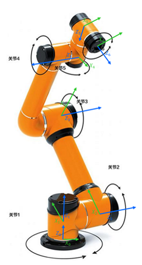
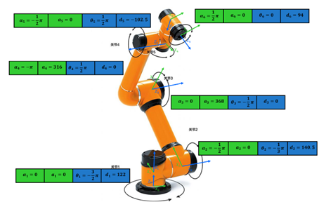
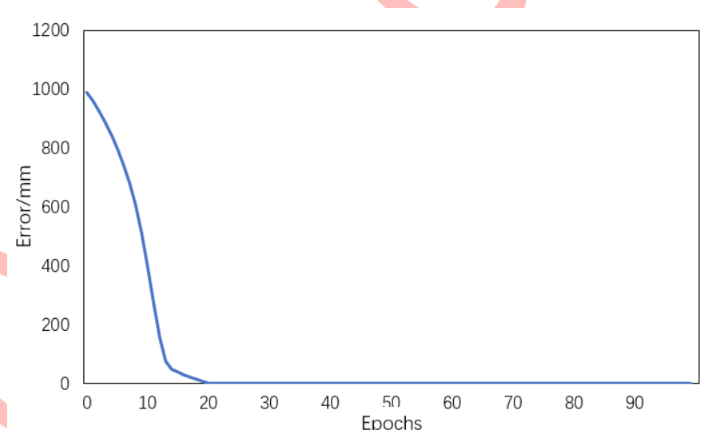
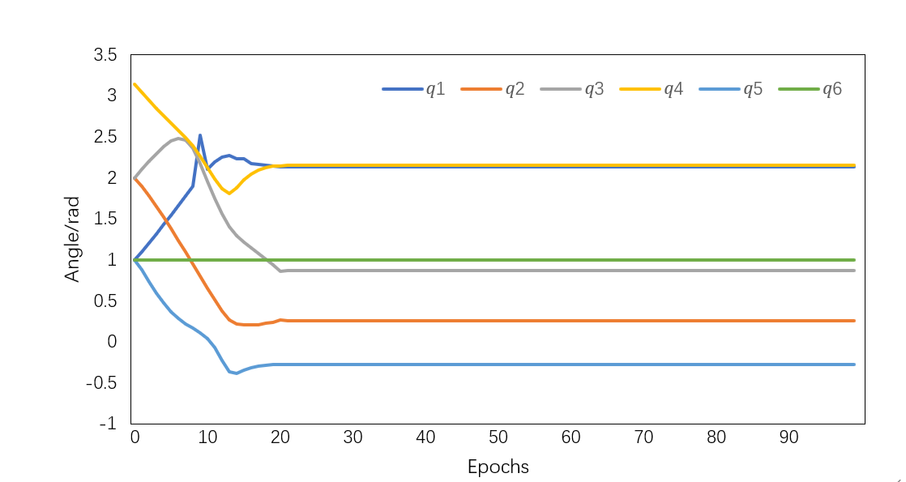
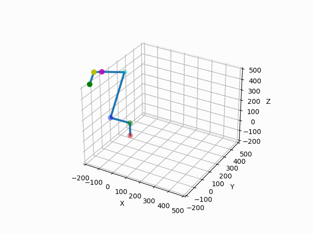

# 基于正向和反向传播的六轴机械臂正逆解模型

# 一、几何基础

对于上述六轴机械臂的数学建模来说，可以构建一个六轴机械臂的运动学正逆解的数学模型，在一个直角坐标系中有如下旋转矩阵：

绕x轴旋转                     
$$
R_x(\theta_x) = \begin{bmatrix} 1 & 0 & 0 \\ 0 & \cos\theta_x & \sin\theta_x \\ 0 & -\sin\theta_x & \cos\theta_x \end{bmatrix}
$$
  （式3-1）

绕y轴旋转 
$$
R_y(\theta_y) = \begin{bmatrix} \cos\theta_y & 0 & -\sin\theta_y \\ 0 & 1 & 0 \\ \sin\theta_y & 0 & \cos\theta_y \end{bmatrix}
$$
（式3-2）

绕z轴旋转 
$$
R_z(\theta_z) = \begin{bmatrix} \cos\theta_z & \sin\theta_z & 0 \\ -\sin\theta_z & \cos\theta_z & 0 \\ 0 & 0 & 1 \end{bmatrix} 
$$
  （式3-3）

在几何学中，任何一个坐标系  ，可以通过三个以上基础旋转，唯一变换到另一个同原点的坐标系  ，两个关系可以用按照变换的先后顺序左乘表示，如下所示。
$$
\begin{bmatrix} X_{w'} \\ Y_{w'} \\ Z_{w'} \end{bmatrix} = R_x(\theta_x) R_y(\theta_y) R_z(\theta_z) \begin{bmatrix} X_w \\ Y_w \\ Z_w \end{bmatrix}
$$
   （式3-4）

# 二、六轴机械臂正解模型

在三维空间里，如果有两个坐标系F0，F6，如果想知道P在F6系中的向量（或者点坐标）在F0系中是多少，可以表示如下：
$$
P_0 = R_{06} P_6 + t_0
$$
​    （式3-5）
$$
\begin{bmatrix} X_0 \\ Y_0 \\ Z_0 \end{bmatrix} = \begin{bmatrix} * & * & * \\ * & * & * \\ * & * & * \end{bmatrix} \begin{bmatrix} X_6 \ Y_6 \ Z_6 \end{bmatrix} + \begin{bmatrix} d_{X_0} \\ d_{Y_0} \\ d_{Z_0} \end{bmatrix}
$$
  （式3-6）

化为齐次形式为：
$$
P_0 = T P_6
$$
  （式3-7）
$$
\begin{bmatrix} X_0 \\ Y_0 \\ Z_0 \\ 1 \end{bmatrix} = \begin{bmatrix} * & * & * & d_{X_0} \\ * & * & * & d_{Y_0} \\ * & * & * & d_{Z_0} \\ 0 & 0 & 0 & 1 \end{bmatrix} \begin{bmatrix} X_6 \\ Y_6 \\ Z_6 \\ 1 \end{bmatrix}
$$
  （式3-8）

如上，机械臂的末端位姿有两部分组成：
$$
(R_{06}, t_0)
$$
   （式3-9）

可以理解为一个是末端原点的坐标  也就是式3-7中的T中的最后一列前三个，一个是旋转量  （或者可以用欧拉角序列、翻滚角-俯仰角-偏航角序列等表示）在机械臂中，可以控制的只有各个关节的电机角度，六轴就是六个电机的角度  ，通过设定六个电机角度，可以把机械臂的末端送到目标的位置。这个过程，数学上相当于机械臂基座的坐标系，通过一些列的旋转平移变换到了末端，由如下的这种机制：
$$
T_{60} = T_{65} T_{54} T_{43} T_{32} T_{21} T_{10} 
$$
  （式3-10）

两边取逆得到：
$$
T_{60}^{-1} = T_{10}^{-1} T_{21}^{-1} T_{32}^{-1} T_{43}^{-1} T_{54}^{-1} T_{65}^{-1}
$$
  （式3-11）

即：
$$
T_{06} = T_{01} T_{12} T_{23} T_{34} T_{45} T_{56}
$$
  （式3-12）

机械臂的建模就是基于类似这样的机制，学者Denavit和Hartenberg经过研究简化后，提出了机器人的DH（Denavit-Hartenberg）建模理论[44]。于是，DH建模所用到的基础旋转矩阵就变为：

绕x轴旋转 
$$
R_x(\theta_x) = \begin{bmatrix} 1 & 0 & 0 \\ 0 & \cos\theta_x & -\sin\theta_x \\ 0 & \sin\theta_x & \cos\theta_x \end{bmatrix} 
$$
​     （式3-13）

绕y轴旋转 
$$
R_y(\theta_y) = \begin{bmatrix} \cos\theta_y & 0 & \sin\theta_y \\ 0 & 1 & 0 \\ -\sin\theta_y & 0 & \cos\theta_y \end{bmatrix} 
$$
 （式3-14）

绕z轴旋转 
$$
R_z(\theta_z) = \begin{bmatrix} \cos\theta_z & -\sin\theta_z & 0 \\ \sin\theta_z & \cos\theta_z & 0 \\ 0 & 0 & 1 \end{bmatrix}
$$
​    （式3-15）

# 三、六轴机械臂DH建模

在机器人学和机械臂设计领域，有两种常用的建模方法：标准Denavit-Hartenberg（SDH）和改进Denavit-Hartenberg（MDH）。为了简化建模过程并提高效率，本文采用MDH规则进行模型构建。MDH方法提供了一种优化的坐标系定义方式，它将坐标系定位在每个连杆的近端，而不是远端，这样做有助于简化计算和减少误差[45]，其主要的原理是这样的，以遨博AUBO-i7H协作机器人为例：

1. 先确定Z轴（各关节的电机转轴）

2. 逐步从固定支座坐标系F0，确定X轴的方向，原则是X轴要是本坐标系Z轴和下一个坐标系Z轴的公垂线。如下图，X0轴应该垂直于Z0，和Z1，那么可以这么定：X0垂直于轴Z0和Z1，X1轴垂直于Z1和Z2，X2应该垂直于Z2和Z3…

 

图3-6 六轴机械臂各坐标系

3. 根据右乘原理，MDH中规定当前关节i的参数先后的顺序是：

以上面的坐标系F1为例，四个参数代表是坐标F0系，先以X0轴旋转Alpha，再沿着X0轴方向移动a（负方向移动为负数），再以Z0为轴旋转Theta，最后沿着Z0方向移动d，最后得到F1坐标系。此处，Alpha=0，X0不需要旋转，a=0，沿着X0没有平移，Theta=  ，沿着Z0逆时针旋转145度，X0轴转到了X1轴的位置，然后d=122mm，沿着Z0正方向移动了122mm，这样经过连续的旋转加平移后，就完成了关节1的参数建模。以此类推，逐步确定其余5组参数。所有的参数确定，如下图所示：

 

图3-7 六轴机械臂的坐标系变换传递

可得到MDH的基本变换矩阵为：
$$
A_iMDH = \begin{bmatrix} \cos\theta_i & -\sin\theta_i & 0 & a_i \\ \sin\theta_i\cos\alpha_i & \cos\theta_i\cos\alpha_i & -\sin\alpha_i & -d_i\sin\alpha_i \\ \sin\theta_i\sin\alpha_i & \cos\theta_i\sin\alpha_i & \cos\alpha_i & d_i\cos\alpha_i \\ 0 & 0 & 0 & 1 \end{bmatrix}
$$
  （式3-16）

即可完成正向求解，所谓正向模型就是输入6个电机的旋转角度及各机械臂段的固定段长，可以得出末端的位姿，这里可以用位姿矩阵表示，。我们根据机械臂实际的尺寸，推导出的正向模型：

$$
A_{MDH} = A_1MDH \cdot A_2MDH \cdot A_3MDH \cdot A_4MDH \cdot A_5MDH \cdot A_6MDH
$$
 （式3-17）

根据参数可求得正向解模型如下，q1、q2、q3、q4、q5、q6为六个电机角度：

Matrix([[6.12323399573677e-17*(-(-1.0*(-(-6.12323399573677e-17*sin(q1 - 4.71238898038469)*sin(q2 - 1.0471975511966) + cos(q1 - 4.71238898038469)*cos(q2 - 1.0471975511966))*sin(q3 - 1.5707963267949) + (-6.12323399573677e-17*sin(q1 - 4.71238898038469)*cos(q2 - 1.0471975511966) - sin(q2 - 1.0471975511966)*cos(q1 - 4.71238898038469))*cos(q3 - 1.5707963267949))*sin(q4 + 1.5707963267949) + ((-6.12323399573677e-17*sin(q1 - 4.71238898038469)*sin(q2 - 1.0471975511966) + cos(q1 - 4.71238898038469)*cos(q2 - 1.0471975511966))*cos(q3 - 1.5707963267949) + (-6.12323399573677e-17*sin(q1 - 4.71238898038469)*cos(q2 - 1.0471975511966) - sin(q2 - 1.0471975511966)*cos(q1 - 4.71238898038469))*sin(q3 - 1.5707963267949))*cos(q4 + 1.5707963267949) + 1.22464679914735e-16*sin(q1 - 4.71238898038469)*sin(q4 + 1.5707963267949))*sin(q5 + 1.5707963267949) + 6.12323399573677e-17*(-1.0*(-(-6.12323399573677e-17*sin(q1 - 4.71238898038469)*sin(q2 - 1.0471975511966) + cos(q1 - 4.71238898038469)*cos(q2 - 1.0471975511966))*sin(q3 - 1.5707963267949) + (-6.12323399573677e-17*sin(q1 - 4.71238898038469)*cos(q2 - 1.0471975511966) - sin(q2 - 1.0471975511966)*cos(q1 - 4.71238898038469))*cos(q3 - 1.5707963267949))*cos(q4 + 1.5707963267949) - ((-6.12323399573677e-17*sin(q1 - 4.71238898038469)*sin(q2 - 1.0471975511966) + cos(q1 - 4.71238898038469)*cos(q2 - 1.0471975511966))*cos(q3 - 1.5707963267949) + (-6.12323399573677e-17*sin(q1 - 4.71238898038469)*cos(q2 - 1.0471975511966) - sin(q2 - 1.0471975511966)*cos(q1 - 4.71238898038469))*sin(q3 - 1.5707963267949))*sin(q4 + 1.5707963267949) + 1.22464679914735e-16*sin(q1 - 4.71238898038469)*cos(q4 + 1.5707963267949))*cos(q5 + 1.5707963267949) - 1.0*(-1.22464679914735e-16*(-6.12323399573677e-17*sin(q1 - 4.71238898038469)*sin(q2 - 1.0471975511966) + cos(q1 - 4.71238898038469)*cos(q2 - 1.0471975511966))*sin(q3 - 1.5707963267949) + 1.22464679914735e-16*(-6.12323399573677e-17*sin(q1 - 4.71238898038469)*cos(q2 - 1.0471975511966) - sin(q2 - 1.0471975511966)*cos(q1 - 4.71238898038469))*cos(q3 - 1.5707963267949) + 1.0*sin(q1 - 4.71238898038469))*cos(q5 + 1.5707963267949))*sin(q6) + ((-1.0*(-(-6.12323399573677e-17*sin(q1 - 4.71238898038469)*sin(q2 - 1.0471975511966) + cos(q1 - 4.71238898038469)*cos(q2 - 1.0471975511966))*sin(q3 - 1.5707963267949) + (-6.12323399573677e-17*sin(q1 - 4.71238898038469)*cos(q2 - 1.0471975511966) - sin(q2 - 1.0471975511966)*cos(q1 - 4.71238898038469))*cos(q3 - 1.5707963267949))*sin(q4 + 1.5707963267949) + ((-6.12323399573677e-17*sin(q1 - 4.71238898038469)*sin(q2 - 1.0471975511966) + cos(q1 - 4.71238898038469)*cos(q2 - 1.0471975511966))*cos(q3 - 1.5707963267949) + (-6.12323399573677e-17*sin(q1 - 4.71238898038469)*cos(q2 - 1.0471975511966) - sin(q2 - 1.0471975511966)*cos(q1 - 4.71238898038469))*sin(q3 - 1.5707963267949))*cos(q4 + 1.5707963267949) + 1.22464679914735e-16*sin(q1 - 4.71238898038469)*sin(q4 + 1.5707963267949))*cos(q5 + 1.5707963267949) + 6.12323399573677e-17*(-1.0*(-(-6.12323399573677e-17*sin(q1 - 4.71238898038469)*sin(q2 - 1.0471975511966) + cos(q1 - 4.71238898038469)*cos(q2 - 1.0471975511966))*sin(q3 - 1.5707963267949) + (-6.12323399573677e-17*sin(q1 - 4.71238898038469)*cos(q2 - 1.0471975511966) - sin(q2 - 1.0471975511966)*cos(q1 - 4.71238898038469))*cos(q3 - 1.5707963267949))*cos(q4 + 1.5707963267949) - ((-6.12323399573677e-17*sin(q1 - 4.71238898038469)*sin(q2 - 1.0471975511966) + cos(q1 - 4.71238898038469)*cos(q2 - 1.0471975511966))*cos(q3 - 1.5707963267949) + (-6.12323399573677e-17*sin(q1 - 4.71238898038469)*cos(q2 - 1.0471975511966) - sin(q2 - 1.0471975511966)*cos(q1 - 4.71238898038469))*sin(q3 - 1.5707963267949))*sin(q4 + 1.5707963267949) + 1.22464679914735e-16*sin(q1 - 4.71238898038469)*cos(q4 + 1.5707963267949))*sin(q5 + 1.5707963267949) - 1.0*(-1.22464679914735e-16*(-6.12323399573677e-17*sin(q1 - 4.71238898038469)*sin(q2 - 1.0471975511966) + cos(q1 - 4.71238898038469)*cos(q2 - 1.0471975511966))*sin(q3 - 1.5707963267949) + 1.22464679914735e-16*(-6.12323399573677e-17*sin(q1 - 4.71238898038469)*cos(q2 - 1.0471975511966) - sin(q2 - 1.0471975511966)*cos(q1 - 4.71238898038469))*cos(q3 - 1.5707963267949) + 1.0*sin(q1 - 4.71238898038469))*sin(q5 + 1.5707963267949))*cos(q6) + 1.0*(-1.0*(-(-6.12323399573677e-17*sin(q1 - 4.71238898038469)*sin(q2 - 1.0471975511966) + cos(q1 - 4.71238898038469)*cos(q2 - 1.0471975511966))*sin(q3 - 1.5707963267949) + (-6.12323399573677e-17*sin(q1 - 4.71238898038469)*cos(q2 - 1.0471975511966) - sin(q2 - 1.0471975511966)*cos(q1 - 4.71238898038469))*cos(q3 - 1.5707963267949))*cos(q4 + 1.5707963267949) - 1.0*((-6.12323399573677e-17*sin(q1 - 4.71238898038469)*sin(q2 - 1.0471975511966) + cos(q1 - 4.71238898038469)*cos(q2 - 1.0471975511966))*cos(q3 - 1.5707963267949) + (-6.12323399573677e-17*sin(q1 - 4.71238898038469)*cos(q2 - 1.0471975511966) - sin(q2 - 1.0471975511966)*cos(q1 - 4.71238898038469))*sin(q3 - 1.5707963267949))*sin(q4 + 1.5707963267949) - 7.49879891330929e-33*(-6.12323399573677e-17*sin(q1 - 4.71238898038469)*sin(q2 - 1.0471975511966) + cos(q1 - 4.71238898038469)*cos(q2 - 1.0471975511966))*sin(q3 - 1.5707963267949) + 7.49879891330929e-33*(-6.12323399573677e-17*sin(q1 - 4.71238898038469)*cos(q2 - 1.0471975511966) - sin(q2 - 1.0471975511966)*cos(q1 - 4.71238898038469))*cos(q3 - 1.5707963267949) + 1.22464679914735e-16*sin(q1 - 4.71238898038469)*cos(q4 + 1.5707963267949) + 6.12323399573677e-17*sin(q1 - 4.71238898038469))*sin(q6), 6.12323399573677e-17*(-(-1.0*(-(-6.12323399573677e-17*sin(q1 - 4.71238898038469)*sin(q2 - 1.0471975511966) + cos(q1 - 4.71238898038469)*cos(q2 - 1.0471975511966))*sin(q3 - 1.5707963267949) + (-6.12323399573677e-17*sin(q1 - 4.71238898038469)*cos(q2 - 1.0471975511966) - sin(q2 - 1.0471975511966)*cos(q1 - 4.71238898038469))*cos(q3 - 1.5707963267949))*sin(q4 + 1.5707963267949) + ((-6.12323399573677e-17*sin(q1 - 4.71238898038469)*sin(q2 - 1.0471975511966) + cos(q1 - 4.71238898038469)*cos(q2 - 1.0471975511966))*cos(q3 - 1.5707963267949) + (-6.12323399573677e-17*sin(q1 - 4.71238898038469)*cos(q2 - 1.0471975511966) - sin(q2 - 1.0471975511966)*cos(q1 - 4.71238898038469))*sin(q3 - 1.5707963267949))*cos(q4 + 1.5707963267949) + 1.22464679914735e-16*sin(q1 - 4.71238898038469)*sin(q4 + 1.5707963267949))*sin(q5 + 1.5707963267949) + 6.12323399573677e-17*(-1.0*(-(-6.12323399573677e-17*sin(q1 - 4.71238898038469)*sin(q2 - 1.0471975511966) + cos(q1 - 4.71238898038469)*cos(q2 - 1.0471975511966))*sin(q3 - 1.5707963267949) + (-6.12323399573677e-17*sin(q1 - 4.71238898038469)*cos(q2 - 1.0471975511966) - sin(q2 - 1.0471975511966)*cos(q1 - 4.71238898038469))*cos(q3 - 1.5707963267949))*cos(q4 + 1.5707963267949) - ((-6.12323399573677e-17*sin(q1 - 4.71238898038469)*sin(q2 - 1.0471975511966) + cos(q1 - 4.71238898038469)*cos(q2 - 1.0471975511966))*cos(q3 - 1.5707963267949) + (-6.12323399573677e-17*sin(q1 - 4.71238898038469)*cos(q2 - 1.0471975511966) - sin(q2 - 1.0471975511966)*cos(q1 - 4.71238898038469))*sin(q3 - 1.5707963267949))*sin(q4 + 1.5707963267949) + 1.22464679914735e-16*sin(q1 - 4.71238898038469)*cos(q4 + 1.5707963267949))*cos(q5 + 1.5707963267949) - 1.0*(-1.22464679914735e-16*(-6.12323399573677e-17*sin(q1 - 4.71238898038469)*sin(q2 - 1.0471975511966) + cos(q1 - 4.71238898038469)*cos(q2 - 1.0471975511966))*sin(q3 - 1.5707963267949) + 1.22464679914735e-16*(-6.12323399573677e-17*sin(q1 - 4.71238898038469)*cos(q2 - 1.0471975511966) - sin(q2 - 1.0471975511966)*cos(q1 - 4.71238898038469))*cos(q3 - 1.5707963267949) + 1.0*sin(q1 - 4.71238898038469))*cos(q5 + 1.5707963267949))*cos(q6) - ((-1.0*(-(-6.12323399573677e-17*sin(q1 - 4.71238898038469)*sin(q2 - 1.0471975511966) + cos(q1 - 4.71238898038469)*cos(q2 - 1.0471975511966))*sin(q3 - 1.5707963267949) + (-6.12323399573677e-17*sin(q1 - 4.71238898038469)*cos(q2 - 1.0471975511966) - sin(q2 - 1.0471975511966)*cos(q1 - 4.71238898038469))*cos(q3 - 1.5707963267949))*sin(q4 + 1.5707963267949) + ((-6.12323399573677e-17*sin(q1 - 4.71238898038469)*sin(q2 - 1.0471975511966) + cos(q1 - 4.71238898038469)*cos(q2 - 1.0471975511966))*cos(q3 - 1.5707963267949) + (-6.12323399573677e-17*sin(q1 - 4.71238898038469)*cos(q2 - 1.0471975511966) - sin(q2 - 1.0471975511966)*cos(q1 - 4.71238898038469))*sin(q3 - 1.5707963267949))*cos(q4 + 1.5707963267949) + 1.22464679914735e-16*sin(q1 - 4.71238898038469)*sin(q4 + 1.5707963267949))*cos(q5 + 1.5707963267949) + 6.12323399573677e-17*(-1.0*(-(-6.12323399573677e-17*sin(q1 - 4.71238898038469)*sin(q2 - 1.0471975511966) + cos(q1 - 4.71238898038469)*cos(q2 - 1.0471975511966))*sin(q3 - 1.5707963267949) + (-6.12323399573677e-17*sin(q1 - 4.71238898038469)*cos(q2 - 1.0471975511966) - sin(q2 - 1.0471975511966)*cos(q1 - 4.71238898038469))*cos(q3 - 1.5707963267949))*cos(q4 + 1.5707963267949) - ((-6.12323399573677e-17*sin(q1 - 4.71238898038469)*sin(q2 - 1.0471975511966) + cos(q1 - 4.71238898038469)*cos(q2 - 1.0471975511966))*cos(q3 - 1.5707963267949) + (-6.12323399573677e-17*sin(q1 - 4.71238898038469)*cos(q2 - 1.0471975511966) - sin(q2 - 1.0471975511966)*cos(q1 - 4.71238898038469))*sin(q3 - 1.5707963267949))*sin(q4 + 1.5707963267949) + 1.22464679914735e-16*sin(q1 - 4.71238898038469)*cos(q4 + 1.5707963267949))*sin(q5 + 1.5707963267949) - 1.0*(-1.22464679914735e-16*(-6.12323399573677e-17*sin(q1 - 4.71238898038469)*sin(q2 - 1.0471975511966) + cos(q1 - 4.71238898038469)*cos(q2 - 1.0471975511966))*sin(q3 - 1.5707963267949) + 1.22464679914735e-16*(-6.12323399573677e-17*sin(q1 - 4.71238898038469)*cos(q2 - 1.0471975511966) - sin(q2 - 1.0471975511966)*cos(q1 - 4.71238898038469))*cos(q3 - 1.5707963267949) + 1.0*sin(q1 - 4.71238898038469))*sin(q5 + 1.5707963267949))*sin(q6) + 1.0*(-1.0*(-(-6.12323399573677e-17*sin(q1 - 4.71238898038469)*sin(q2 - 1.0471975511966) + cos(q1 - 4.71238898038469)*cos(q2 - 1.0471975511966))*sin(q3 - 1.5707963267949) + (-6.12323399573677e-17*sin(q1 - 4.71238898038469)*cos(q2 - 1.0471975511966) - sin(q2 - 1.0471975511966)*cos(q1 - 4.71238898038469))*cos(q3 - 1.5707963267949))*cos(q4 + 1.5707963267949) - 1.0*((-6.12323399573677e-17*sin(q1 - 4.71238898038469)*sin(q2 - 1.0471975511966) + cos(q1 - 4.71238898038469)*cos(q2 - 1.0471975511966))*cos(q3 - 1.5707963267949) + (-6.12323399573677e-17*sin(q1 - 4.71238898038469)*cos(q2 - 1.0471975511966) - sin(q2 - 1.0471975511966)*cos(q1 - 4.71238898038469))*sin(q3 - 1.5707963267949))*sin(q4 + 1.5707963267949) - 7.49879891330929e-33*(-6.12323399573677e-17*sin(q1 - 4.71238898038469)*sin(q2 - 1.0471975511966) + cos(q1 - 4.71238898038469)*cos(q2 - 1.0471975511966))*sin(q3 - 1.5707963267949) + 7.49879891330929e-33*(-6.12323399573677e-17*sin(q1 - 4.71238898038469)*cos(q2 - 1.0471975511966) - sin(q2 - 1.0471975511966)*cos(q1 - 4.71238898038469))*cos(q3 - 1.5707963267949) + 1.22464679914735e-16*sin(q1 - 4.71238898038469)*cos(q4 + 1.5707963267949) + 6.12323399573677e-17*sin(q1 - 4.71238898038469))*cos(q6), -6.12323399573677e-17*(-(-6.12323399573677e-17*sin(q1 - 4.71238898038469)*sin(q2 - 1.0471975511966) + cos(q1 - 4.71238898038469)*cos(q2 - 1.0471975511966))*sin(q3 - 1.5707963267949) + (-6.12323399573677e-17*sin(q1 - 4.71238898038469)*cos(q2 - 1.0471975511966) - sin(q2 - 1.0471975511966)*cos(q1 - 4.71238898038469))*cos(q3 - 1.5707963267949))*cos(q4 + 1.5707963267949) - 6.12323399573677e-17*((-6.12323399573677e-17*sin(q1 - 4.71238898038469)*sin(q2 - 1.0471975511966) + cos(q1 - 4.71238898038469)*cos(q2 - 1.0471975511966))*cos(q3 - 1.5707963267949) + (-6.12323399573677e-17*sin(q1 - 4.71238898038469)*cos(q2 - 1.0471975511966) - sin(q2 - 1.0471975511966)*cos(q1 - 4.71238898038469))*sin(q3 - 1.5707963267949))*sin(q4 + 1.5707963267949) - 4.59169004331693e-49*(-6.12323399573677e-17*sin(q1 - 4.71238898038469)*sin(q2 - 1.0471975511966) + cos(q1 - 4.71238898038469)*cos(q2 - 1.0471975511966))*sin(q3 - 1.5707963267949) + 4.59169004331693e-49*(-6.12323399573677e-17*sin(q1 - 4.71238898038469)*cos(q2 - 1.0471975511966) - sin(q2 - 1.0471975511966)*cos(q1 - 4.71238898038469))*cos(q3 - 1.5707963267949) + 1.0*(-1.0*(-(-6.12323399573677e-17*sin(q1 - 4.71238898038469)*sin(q2 - 1.0471975511966) + cos(q1 - 4.71238898038469)*cos(q2 - 1.0471975511966))*sin(q3 - 1.5707963267949) + (-6.12323399573677e-17*sin(q1 - 4.71238898038469)*cos(q2 - 1.0471975511966) - sin(q2 - 1.0471975511966)*cos(q1 - 4.71238898038469))*cos(q3 - 1.5707963267949))*sin(q4 + 1.5707963267949) + ((-6.12323399573677e-17*sin(q1 - 4.71238898038469)*sin(q2 - 1.0471975511966) + cos(q1 - 4.71238898038469)*cos(q2 - 1.0471975511966))*cos(q3 - 1.5707963267949) + (-6.12323399573677e-17*sin(q1 - 4.71238898038469)*cos(q2 - 1.0471975511966) - sin(q2 - 1.0471975511966)*cos(q1 - 4.71238898038469))*sin(q3 - 1.5707963267949))*cos(q4 + 1.5707963267949) + 1.22464679914735e-16*sin(q1 - 4.71238898038469)*sin(q4 + 1.5707963267949))*sin(q5 + 1.5707963267949) - 6.12323399573677e-17*(-1.0*(-(-6.12323399573677e-17*sin(q1 - 4.71238898038469)*sin(q2 - 1.0471975511966) + cos(q1 - 4.71238898038469)*cos(q2 - 1.0471975511966))*sin(q3 - 1.5707963267949) + (-6.12323399573677e-17*sin(q1 - 4.71238898038469)*cos(q2 - 1.0471975511966) - sin(q2 - 1.0471975511966)*cos(q1 - 4.71238898038469))*cos(q3 - 1.5707963267949))*cos(q4 + 1.5707963267949) - ((-6.12323399573677e-17*sin(q1 - 4.71238898038469)*sin(q2 - 1.0471975511966) + cos(q1 - 4.71238898038469)*cos(q2 - 1.0471975511966))*cos(q3 - 1.5707963267949) + (-6.12323399573677e-17*sin(q1 - 4.71238898038469)*cos(q2 - 1.0471975511966) - sin(q2 - 1.0471975511966)*cos(q1 - 4.71238898038469))*sin(q3 - 1.5707963267949))*sin(q4 + 1.5707963267949) + 1.22464679914735e-16*sin(q1 - 4.71238898038469)*cos(q4 + 1.5707963267949))*cos(q5 + 1.5707963267949) + 1.0*(-1.22464679914735e-16*(-6.12323399573677e-17*sin(q1 - 4.71238898038469)*sin(q2 - 1.0471975511966) + cos(q1 - 4.71238898038469)*cos(q2 - 1.0471975511966))*sin(q3 - 1.5707963267949) + 1.22464679914735e-16*(-6.12323399573677e-17*sin(q1 - 4.71238898038469)*cos(q2 - 1.0471975511966) - sin(q2 - 1.0471975511966)*cos(q1 - 4.71238898038469))*cos(q3 - 1.5707963267949) + 1.0*sin(q1 - 4.71238898038469))*cos(q5 + 1.5707963267949) + 7.49879891330929e-33*sin(q1 - 4.71238898038469)*cos(q4 + 1.5707963267949) + 3.74939945665464e-33*sin(q1 - 4.71238898038469), 102.5*(-(-6.12323399573677e-17*sin(q1 - 4.71238898038469)*sin(q2 - 1.0471975511966) + cos(q1 - 4.71238898038469)*cos(q2 - 1.0471975511966))*sin(q3 - 1.5707963267949) + (-6.12323399573677e-17*sin(q1 - 4.71238898038469)*cos(q2 - 1.0471975511966) - sin(q2 - 1.0471975511966)*cos(q1 - 4.71238898038469))*cos(q3 - 1.5707963267949))*cos(q4 + 1.5707963267949) + 102.5*((-6.12323399573677e-17*sin(q1 - 4.71238898038469)*sin(q2 - 1.0471975511966) + cos(q1 - 4.71238898038469)*cos(q2 - 1.0471975511966))*cos(q3 - 1.5707963267949) + (-6.12323399573677e-17*sin(q1 - 4.71238898038469)*cos(q2 - 1.0471975511966) - sin(q2 - 1.0471975511966)*cos(q1 - 4.71238898038469))*sin(q3 - 1.5707963267949))*sin(q4 + 1.5707963267949) + 7.68626888614202e-31*(-6.12323399573677e-17*sin(q1 - 4.71238898038469)*sin(q2 - 1.0471975511966) + cos(q1 - 4.71238898038469)*cos(q2 - 1.0471975511966))*sin(q3 - 1.5707963267949) + 316*(-6.12323399573677e-17*sin(q1 - 4.71238898038469)*sin(q2 - 1.0471975511966) + cos(q1 - 4.71238898038469)*cos(q2 - 1.0471975511966))*cos(q3 - 1.5707963267949) + 316*(-6.12323399573677e-17*sin(q1 - 4.71238898038469)*cos(q2 - 1.0471975511966) - sin(q2 - 1.0471975511966)*cos(q1 - 4.71238898038469))*sin(q3 - 1.5707963267949) - 7.68626888614202e-31*(-6.12323399573677e-17*sin(q1 - 4.71238898038469)*cos(q2 - 1.0471975511966) - sin(q2 - 1.0471975511966)*cos(q1 - 4.71238898038469))*cos(q3 - 1.5707963267949) + 94.0*(-1.0*(-(-6.12323399573677e-17*sin(q1 - 4.71238898038469)*sin(q2 - 1.0471975511966) + cos(q1 - 4.71238898038469)*cos(q2 - 1.0471975511966))*sin(q3 - 1.5707963267949) + (-6.12323399573677e-17*sin(q1 - 4.71238898038469)*cos(q2 - 1.0471975511966) - sin(q2 - 1.0471975511966)*cos(q1 - 4.71238898038469))*cos(q3 - 1.5707963267949))*sin(q4 + 1.5707963267949) + ((-6.12323399573677e-17*sin(q1 - 4.71238898038469)*sin(q2 - 1.0471975511966) + cos(q1 - 4.71238898038469)*cos(q2 - 1.0471975511966))*cos(q3 - 1.5707963267949) + (-6.12323399573677e-17*sin(q1 - 4.71238898038469)*cos(q2 - 1.0471975511966) - sin(q2 - 1.0471975511966)*cos(q1 - 4.71238898038469))*sin(q3 - 1.5707963267949))*cos(q4 + 1.5707963267949) + 1.22464679914735e-16*sin(q1 - 4.71238898038469)*sin(q4 + 1.5707963267949))*sin(q5 + 1.5707963267949) - 5.75583995599256e-15*(-1.0*(-(-6.12323399573677e-17*sin(q1 - 4.71238898038469)*sin(q2 - 1.0471975511966) + cos(q1 - 4.71238898038469)*cos(q2 - 1.0471975511966))*sin(q3 - 1.5707963267949) + (-6.12323399573677e-17*sin(q1 - 4.71238898038469)*cos(q2 - 1.0471975511966) - sin(q2 - 1.0471975511966)*cos(q1 - 4.71238898038469))*cos(q3 - 1.5707963267949))*cos(q4 + 1.5707963267949) - ((-6.12323399573677e-17*sin(q1 - 4.71238898038469)*sin(q2 - 1.0471975511966) + cos(q1 - 4.71238898038469)*cos(q2 - 1.0471975511966))*cos(q3 - 1.5707963267949) + (-6.12323399573677e-17*sin(q1 - 4.71238898038469)*cos(q2 - 1.0471975511966) - sin(q2 - 1.0471975511966)*cos(q1 - 4.71238898038469))*sin(q3 - 1.5707963267949))*sin(q4 + 1.5707963267949) + 1.22464679914735e-16*sin(q1 - 4.71238898038469)*cos(q4 + 1.5707963267949))*cos(q5 + 1.5707963267949) + 94.0*(-1.22464679914735e-16*(-6.12323399573677e-17*sin(q1 - 4.71238898038469)*sin(q2 - 1.0471975511966) + cos(q1 - 4.71238898038469)*cos(q2 - 1.0471975511966))*sin(q3 - 1.5707963267949) + 1.22464679914735e-16*(-6.12323399573677e-17*sin(q1 - 4.71238898038469)*cos(q2 - 1.0471975511966) - sin(q2 - 1.0471975511966)*cos(q1 - 4.71238898038469))*cos(q3 - 1.5707963267949) + 1.0*sin(q1 - 4.71238898038469))*cos(q5 + 1.5707963267949) - 2.25335011043113e-14*sin(q1 - 4.71238898038469)*sin(q2 - 1.0471975511966) - 1.25526296912604e-14*sin(q1 - 4.71238898038469)*cos(q4 + 1.5707963267949) - 140.5*sin(q1 - 4.71238898038469) + 368*cos(q1 - 4.71238898038469)*cos(q2 - 1.0471975511966)], [(6.12323399573677e-17*(-((-sin(q1 - 4.71238898038469)*sin(q2 - 1.0471975511966) + 6.12323399573677e-17*cos(q1 - 4.71238898038469)*cos(q2 - 1.0471975511966))*sin(q3 - 1.5707963267949) + (sin(q1 - 4.71238898038469)*cos(q2 - 1.0471975511966) + 6.12323399573677e-17*sin(q2 - 1.0471975511966)*cos(q1 - 4.71238898038469))*cos(q3 - 1.5707963267949))*sin(q4 + 1.5707963267949) - 1.0*((-sin(q1 - 4.71238898038469)*sin(q2 - 1.0471975511966) + 6.12323399573677e-17*cos(q1 - 4.71238898038469)*cos(q2 - 1.0471975511966))*cos(q3 - 1.5707963267949) - (sin(q1 - 4.71238898038469)*cos(q2 - 1.0471975511966) + 6.12323399573677e-17*sin(q2 - 1.0471975511966)*cos(q1 - 4.71238898038469))*sin(q3 - 1.5707963267949))*cos(q4 + 1.5707963267949) - 1.22464679914735e-16*cos(q1 - 4.71238898038469)*cos(q4 + 1.5707963267949))*sin(q5 + 1.5707963267949) + (((-sin(q1 - 4.71238898038469)*sin(q2 - 1.0471975511966) + 6.12323399573677e-17*cos(q1 - 4.71238898038469)*cos(q2 - 1.0471975511966))*sin(q3 - 1.5707963267949) + (sin(q1 - 4.71238898038469)*cos(q2 - 1.0471975511966) + 6.12323399573677e-17*sin(q2 - 1.0471975511966)*cos(q1 - 4.71238898038469))*cos(q3 - 1.5707963267949))*cos(q4 + 1.5707963267949) - 1.0*((-sin(q1 - 4.71238898038469)*sin(q2 - 1.0471975511966) + 6.12323399573677e-17*cos(q1 - 4.71238898038469)*cos(q2 - 1.0471975511966))*cos(q3 - 1.5707963267949) - (sin(q1 - 4.71238898038469)*cos(q2 - 1.0471975511966) + 6.12323399573677e-17*sin(q2 - 1.0471975511966)*cos(q1 - 4.71238898038469))*sin(q3 - 1.5707963267949))*sin(q4 + 1.5707963267949) - 1.22464679914735e-16*sin(q4 + 1.5707963267949)*cos(q1 - 4.71238898038469))*cos(q5 + 1.5707963267949) - 1.0*(1.22464679914735e-16*(-sin(q1 - 4.71238898038469)*sin(q2 - 1.0471975511966) + 6.12323399573677e-17*cos(q1 - 4.71238898038469)*cos(q2 - 1.0471975511966))*cos(q3 - 1.5707963267949) - 1.22464679914735e-16*(sin(q1 - 4.71238898038469)*cos(q2 - 1.0471975511966) + 6.12323399573677e-17*sin(q2 - 1.0471975511966)*cos(q1 - 4.71238898038469))*sin(q3 - 1.5707963267949) - 1.0*cos(q1 - 4.71238898038469))*sin(q5 + 1.5707963267949))*cos(q6) + 6.12323399573677e-17*(6.12323399573677e-17*(-((-sin(q1 - 4.71238898038469)*sin(q2 - 1.0471975511966) + 6.12323399573677e-17*cos(q1 - 4.71238898038469)*cos(q2 - 1.0471975511966))*sin(q3 - 1.5707963267949) + (sin(q1 - 4.71238898038469)*cos(q2 - 1.0471975511966) + 6.12323399573677e-17*sin(q2 - 1.0471975511966)*cos(q1 - 4.71238898038469))*cos(q3 - 1.5707963267949))*sin(q4 + 1.5707963267949) - 1.0*((-sin(q1 - 4.71238898038469)*sin(q2 - 1.0471975511966) + 6.12323399573677e-17*cos(q1 - 4.71238898038469)*cos(q2 - 1.0471975511966))*cos(q3 - 1.5707963267949) - (sin(q1 - 4.71238898038469)*cos(q2 - 1.0471975511966) + 6.12323399573677e-17*sin(q2 - 1.0471975511966)*cos(q1 - 4.71238898038469))*sin(q3 - 1.5707963267949))*cos(q4 + 1.5707963267949) - 1.22464679914735e-16*cos(q1 - 4.71238898038469)*cos(q4 + 1.5707963267949))*cos(q5 + 1.5707963267949) - (((-sin(q1 - 4.71238898038469)*sin(q2 - 1.0471975511966) + 6.12323399573677e-17*cos(q1 - 4.71238898038469)*cos(q2 - 1.0471975511966))*sin(q3 - 1.5707963267949) + (sin(q1 - 4.71238898038469)*cos(q2 - 1.0471975511966) + 6.12323399573677e-17*sin(q2 - 1.0471975511966)*cos(q1 - 4.71238898038469))*cos(q3 - 1.5707963267949))*cos(q4 + 1.5707963267949) - 1.0*((-sin(q1 - 4.71238898038469)*sin(q2 - 1.0471975511966) + 6.12323399573677e-17*cos(q1 - 4.71238898038469)*cos(q2 - 1.0471975511966))*cos(q3 - 1.5707963267949) - (sin(q1 - 4.71238898038469)*cos(q2 - 1.0471975511966) + 6.12323399573677e-17*sin(q2 - 1.0471975511966)*cos(q1 - 4.71238898038469))*sin(q3 - 1.5707963267949))*sin(q4 + 1.5707963267949) - 1.22464679914735e-16*sin(q4 + 1.5707963267949)*cos(q1 - 4.71238898038469))*sin(q5 + 1.5707963267949) - 1.0*(1.22464679914735e-16*(-sin(q1 - 4.71238898038469)*sin(q2 - 1.0471975511966) + 6.12323399573677e-17*cos(q1 - 4.71238898038469)*cos(q2 - 1.0471975511966))*cos(q3 - 1.5707963267949) - 1.22464679914735e-16*(sin(q1 - 4.71238898038469)*cos(q2 - 1.0471975511966) + 6.12323399573677e-17*sin(q2 - 1.0471975511966)*cos(q1 - 4.71238898038469))*sin(q3 - 1.5707963267949) - 1.0*cos(q1 - 4.71238898038469))*cos(q5 + 1.5707963267949))*sin(q6) + 1.0*(-1.0*((-sin(q1 - 4.71238898038469)*sin(q2 - 1.0471975511966) + 6.12323399573677e-17*cos(q1 - 4.71238898038469)*cos(q2 - 1.0471975511966))*sin(q3 - 1.5707963267949) + (sin(q1 - 4.71238898038469)*cos(q2 - 1.0471975511966) + 6.12323399573677e-17*sin(q2 - 1.0471975511966)*cos(q1 - 4.71238898038469))*cos(q3 - 1.5707963267949))*sin(q4 + 1.5707963267949) - 1.0*((-sin(q1 - 4.71238898038469)*sin(q2 - 1.0471975511966) + 6.12323399573677e-17*cos(q1 - 4.71238898038469)*cos(q2 - 1.0471975511966))*cos(q3 - 1.5707963267949) - (sin(q1 - 4.71238898038469)*cos(q2 - 1.0471975511966) + 6.12323399573677e-17*sin(q2 - 1.0471975511966)*cos(q1 - 4.71238898038469))*sin(q3 - 1.5707963267949))*cos(q4 + 1.5707963267949) + 7.49879891330929e-33*(-sin(q1 - 4.71238898038469)*sin(q2 - 1.0471975511966) + 6.12323399573677e-17*cos(q1 - 4.71238898038469)*cos(q2 - 1.0471975511966))*cos(q3 - 1.5707963267949) - 7.49879891330929e-33*(sin(q1 - 4.71238898038469)*cos(q2 - 1.0471975511966) + 6.12323399573677e-17*sin(q2 - 1.0471975511966)*cos(q1 - 4.71238898038469))*sin(q3 - 1.5707963267949) - 1.22464679914735e-16*cos(q1 - 4.71238898038469)*cos(q4 + 1.5707963267949) - 6.12323399573677e-17*cos(q1 - 4.71238898038469))*sin(q6), -(6.12323399573677e-17*(-((-sin(q1 - 4.71238898038469)*sin(q2 - 1.0471975511966) + 6.12323399573677e-17*cos(q1 - 4.71238898038469)*cos(q2 - 1.0471975511966))*sin(q3 - 1.5707963267949) + (sin(q1 - 4.71238898038469)*cos(q2 - 1.0471975511966) + 6.12323399573677e-17*sin(q2 - 1.0471975511966)*cos(q1 - 4.71238898038469))*cos(q3 - 1.5707963267949))*sin(q4 + 1.5707963267949) - 1.0*((-sin(q1 - 4.71238898038469)*sin(q2 - 1.0471975511966) + 6.12323399573677e-17*cos(q1 - 4.71238898038469)*cos(q2 - 1.0471975511966))*cos(q3 - 1.5707963267949) - (sin(q1 - 4.71238898038469)*cos(q2 - 1.0471975511966) + 6.12323399573677e-17*sin(q2 - 1.0471975511966)*cos(q1 - 4.71238898038469))*sin(q3 - 1.5707963267949))*cos(q4 + 1.5707963267949) - 1.22464679914735e-16*cos(q1 - 4.71238898038469)*cos(q4 + 1.5707963267949))*sin(q5 + 1.5707963267949) + (((-sin(q1 - 4.71238898038469)*sin(q2 - 1.0471975511966) + 6.12323399573677e-17*cos(q1 - 4.71238898038469)*cos(q2 - 1.0471975511966))*sin(q3 - 1.5707963267949) + (sin(q1 - 4.71238898038469)*cos(q2 - 1.0471975511966) + 6.12323399573677e-17*sin(q2 - 1.0471975511966)*cos(q1 - 4.71238898038469))*cos(q3 - 1.5707963267949))*cos(q4 + 1.5707963267949) - 1.0*((-sin(q1 - 4.71238898038469)*sin(q2 - 1.0471975511966) + 6.12323399573677e-17*cos(q1 - 4.71238898038469)*cos(q2 - 1.0471975511966))*cos(q3 - 1.5707963267949) - (sin(q1 - 4.71238898038469)*cos(q2 - 1.0471975511966) + 6.12323399573677e-17*sin(q2 - 1.0471975511966)*cos(q1 - 4.71238898038469))*sin(q3 - 1.5707963267949))*sin(q4 + 1.5707963267949) - 1.22464679914735e-16*sin(q4 + 1.5707963267949)*cos(q1 - 4.71238898038469))*cos(q5 + 1.5707963267949) - 1.0*(1.22464679914735e-16*(-sin(q1 - 4.71238898038469)*sin(q2 - 1.0471975511966) + 6.12323399573677e-17*cos(q1 - 4.71238898038469)*cos(q2 - 1.0471975511966))*cos(q3 - 1.5707963267949) - 1.22464679914735e-16*(sin(q1 - 4.71238898038469)*cos(q2 - 1.0471975511966) + 6.12323399573677e-17*sin(q2 - 1.0471975511966)*cos(q1 - 4.71238898038469))*sin(q3 - 1.5707963267949) - 1.0*cos(q1 - 4.71238898038469))*sin(q5 + 1.5707963267949))*sin(q6) + 6.12323399573677e-17*(6.12323399573677e-17*(-((-sin(q1 - 4.71238898038469)*sin(q2 - 1.0471975511966) + 6.12323399573677e-17*cos(q1 - 4.71238898038469)*cos(q2 - 1.0471975511966))*sin(q3 - 1.5707963267949) + (sin(q1 - 4.71238898038469)*cos(q2 - 1.0471975511966) + 6.12323399573677e-17*sin(q2 - 1.0471975511966)*cos(q1 - 4.71238898038469))*cos(q3 - 1.5707963267949))*sin(q4 + 1.5707963267949) - 1.0*((-sin(q1 - 4.71238898038469)*sin(q2 - 1.0471975511966) + 6.12323399573677e-17*cos(q1 - 4.71238898038469)*cos(q2 - 1.0471975511966))*cos(q3 - 1.5707963267949) - (sin(q1 - 4.71238898038469)*cos(q2 - 1.0471975511966) + 6.12323399573677e-17*sin(q2 - 1.0471975511966)*cos(q1 - 4.71238898038469))*sin(q3 - 1.5707963267949))*cos(q4 + 1.5707963267949) - 1.22464679914735e-16*cos(q1 - 4.71238898038469)*cos(q4 + 1.5707963267949))*cos(q5 + 1.5707963267949) - (((-sin(q1 - 4.71238898038469)*sin(q2 - 1.0471975511966) + 6.12323399573677e-17*cos(q1 - 4.71238898038469)*cos(q2 - 1.0471975511966))*sin(q3 - 1.5707963267949) + (sin(q1 - 4.71238898038469)*cos(q2 - 1.0471975511966) + 6.12323399573677e-17*sin(q2 - 1.0471975511966)*cos(q1 - 4.71238898038469))*cos(q3 - 1.5707963267949))*cos(q4 + 1.5707963267949) - 1.0*((-sin(q1 - 4.71238898038469)*sin(q2 - 1.0471975511966) + 6.12323399573677e-17*cos(q1 - 4.71238898038469)*cos(q2 - 1.0471975511966))*cos(q3 - 1.5707963267949) - (sin(q1 - 4.71238898038469)*cos(q2 - 1.0471975511966) + 6.12323399573677e-17*sin(q2 - 1.0471975511966)*cos(q1 - 4.71238898038469))*sin(q3 - 1.5707963267949))*sin(q4 + 1.5707963267949) - 1.22464679914735e-16*sin(q4 + 1.5707963267949)*cos(q1 - 4.71238898038469))*sin(q5 + 1.5707963267949) - 1.0*(1.22464679914735e-16*(-sin(q1 - 4.71238898038469)*sin(q2 - 1.0471975511966) + 6.12323399573677e-17*cos(q1 - 4.71238898038469)*cos(q2 - 1.0471975511966))*cos(q3 - 1.5707963267949) - 1.22464679914735e-16*(sin(q1 - 4.71238898038469)*cos(q2 - 1.0471975511966) + 6.12323399573677e-17*sin(q2 - 1.0471975511966)*cos(q1 - 4.71238898038469))*sin(q3 - 1.5707963267949) - 1.0*cos(q1 - 4.71238898038469))*cos(q5 + 1.5707963267949))*cos(q6) + 1.0*(-1.0*((-sin(q1 - 4.71238898038469)*sin(q2 - 1.0471975511966) + 6.12323399573677e-17*cos(q1 - 4.71238898038469)*cos(q2 - 1.0471975511966))*sin(q3 - 1.5707963267949) + (sin(q1 - 4.71238898038469)*cos(q2 - 1.0471975511966) + 6.12323399573677e-17*sin(q2 - 1.0471975511966)*cos(q1 - 4.71238898038469))*cos(q3 - 1.5707963267949))*sin(q4 + 1.5707963267949) - 1.0*((-sin(q1 - 4.71238898038469)*sin(q2 - 1.0471975511966) + 6.12323399573677e-17*cos(q1 - 4.71238898038469)*cos(q2 - 1.0471975511966))*cos(q3 - 1.5707963267949) - (sin(q1 - 4.71238898038469)*cos(q2 - 1.0471975511966) + 6.12323399573677e-17*sin(q2 - 1.0471975511966)*cos(q1 - 4.71238898038469))*sin(q3 - 1.5707963267949))*cos(q4 + 1.5707963267949) + 7.49879891330929e-33*(-sin(q1 - 4.71238898038469)*sin(q2 - 1.0471975511966) + 6.12323399573677e-17*cos(q1 - 4.71238898038469)*cos(q2 - 1.0471975511966))*cos(q3 - 1.5707963267949) - 7.49879891330929e-33*(sin(q1 - 4.71238898038469)*cos(q2 - 1.0471975511966) + 6.12323399573677e-17*sin(q2 - 1.0471975511966)*cos(q1 - 4.71238898038469))*sin(q3 - 1.5707963267949) - 1.22464679914735e-16*cos(q1 - 4.71238898038469)*cos(q4 + 1.5707963267949) - 6.12323399573677e-17*cos(q1 - 4.71238898038469))*cos(q6), -6.12323399573677e-17*((-sin(q1 - 4.71238898038469)*sin(q2 - 1.0471975511966) + 6.12323399573677e-17*cos(q1 - 4.71238898038469)*cos(q2 - 1.0471975511966))*sin(q3 - 1.5707963267949) + (sin(q1 - 4.71238898038469)*cos(q2 - 1.0471975511966) + 6.12323399573677e-17*sin(q2 - 1.0471975511966)*cos(q1 - 4.71238898038469))*cos(q3 - 1.5707963267949))*sin(q4 + 1.5707963267949) - 6.12323399573677e-17*((-sin(q1 - 4.71238898038469)*sin(q2 - 1.0471975511966) + 6.12323399573677e-17*cos(q1 - 4.71238898038469)*cos(q2 - 1.0471975511966))*cos(q3 - 1.5707963267949) - (sin(q1 - 4.71238898038469)*cos(q2 - 1.0471975511966) + 6.12323399573677e-17*sin(q2 - 1.0471975511966)*cos(q1 - 4.71238898038469))*sin(q3 - 1.5707963267949))*cos(q4 + 1.5707963267949) + 4.59169004331693e-49*(-sin(q1 - 4.71238898038469)*sin(q2 - 1.0471975511966) + 6.12323399573677e-17*cos(q1 - 4.71238898038469)*cos(q2 - 1.0471975511966))*cos(q3 - 1.5707963267949) - 4.59169004331693e-49*(sin(q1 - 4.71238898038469)*cos(q2 - 1.0471975511966) + 6.12323399573677e-17*sin(q2 - 1.0471975511966)*cos(q1 - 4.71238898038469))*sin(q3 - 1.5707963267949) - 6.12323399573677e-17*(-((-sin(q1 - 4.71238898038469)*sin(q2 - 1.0471975511966) + 6.12323399573677e-17*cos(q1 - 4.71238898038469)*cos(q2 - 1.0471975511966))*sin(q3 - 1.5707963267949) + (sin(q1 - 4.71238898038469)*cos(q2 - 1.0471975511966) + 6.12323399573677e-17*sin(q2 - 1.0471975511966)*cos(q1 - 4.71238898038469))*cos(q3 - 1.5707963267949))*sin(q4 + 1.5707963267949) - 1.0*((-sin(q1 - 4.71238898038469)*sin(q2 - 1.0471975511966) + 6.12323399573677e-17*cos(q1 - 4.71238898038469)*cos(q2 - 1.0471975511966))*cos(q3 - 1.5707963267949) - (sin(q1 - 4.71238898038469)*cos(q2 - 1.0471975511966) + 6.12323399573677e-17*sin(q2 - 1.0471975511966)*cos(q1 - 4.71238898038469))*sin(q3 - 1.5707963267949))*cos(q4 + 1.5707963267949) - 1.22464679914735e-16*cos(q1 - 4.71238898038469)*cos(q4 + 1.5707963267949))*cos(q5 + 1.5707963267949) + 1.0*(((-sin(q1 - 4.71238898038469)*sin(q2 - 1.0471975511966) + 6.12323399573677e-17*cos(q1 - 4.71238898038469)*cos(q2 - 1.0471975511966))*sin(q3 - 1.5707963267949) + (sin(q1 - 4.71238898038469)*cos(q2 - 1.0471975511966) + 6.12323399573677e-17*sin(q2 - 1.0471975511966)*cos(q1 - 4.71238898038469))*cos(q3 - 1.5707963267949))*cos(q4 + 1.5707963267949) - 1.0*((-sin(q1 - 4.71238898038469)*sin(q2 - 1.0471975511966) + 6.12323399573677e-17*cos(q1 - 4.71238898038469)*cos(q2 - 1.0471975511966))*cos(q3 - 1.5707963267949) - (sin(q1 - 4.71238898038469)*cos(q2 - 1.0471975511966) + 6.12323399573677e-17*sin(q2 - 1.0471975511966)*cos(q1 - 4.71238898038469))*sin(q3 - 1.5707963267949))*sin(q4 + 1.5707963267949) - 1.22464679914735e-16*sin(q4 + 1.5707963267949)*cos(q1 - 4.71238898038469))*sin(q5 + 1.5707963267949) + 1.0*(1.22464679914735e-16*(-sin(q1 - 4.71238898038469)*sin(q2 - 1.0471975511966) + 6.12323399573677e-17*cos(q1 - 4.71238898038469)*cos(q2 - 1.0471975511966))*cos(q3 - 1.5707963267949) - 1.22464679914735e-16*(sin(q1 - 4.71238898038469)*cos(q2 - 1.0471975511966) + 6.12323399573677e-17*sin(q2 - 1.0471975511966)*cos(q1 - 4.71238898038469))*sin(q3 - 1.5707963267949) - 1.0*cos(q1 - 4.71238898038469))*cos(q5 + 1.5707963267949) - 7.49879891330929e-33*cos(q1 - 4.71238898038469)*cos(q4 + 1.5707963267949) - 3.74939945665464e-33*cos(q1 - 4.71238898038469), 102.5*((-sin(q1 - 4.71238898038469)*sin(q2 - 1.0471975511966) + 6.12323399573677e-17*cos(q1 - 4.71238898038469)*cos(q2 - 1.0471975511966))*sin(q3 - 1.5707963267949) + (sin(q1 - 4.71238898038469)*cos(q2 - 1.0471975511966) + 6.12323399573677e-17*sin(q2 - 1.0471975511966)*cos(q1 - 4.71238898038469))*cos(q3 - 1.5707963267949))*sin(q4 + 1.5707963267949) + 102.5*((-sin(q1 - 4.71238898038469)*sin(q2 - 1.0471975511966) + 6.12323399573677e-17*cos(q1 - 4.71238898038469)*cos(q2 - 1.0471975511966))*cos(q3 - 1.5707963267949) - (sin(q1 - 4.71238898038469)*cos(q2 - 1.0471975511966) + 6.12323399573677e-17*sin(q2 - 1.0471975511966)*cos(q1 - 4.71238898038469))*sin(q3 - 1.5707963267949))*cos(q4 + 1.5707963267949) + 316*(-sin(q1 - 4.71238898038469)*sin(q2 - 1.0471975511966) + 6.12323399573677e-17*cos(q1 - 4.71238898038469)*cos(q2 - 1.0471975511966))*sin(q3 - 1.5707963267949) - 7.68626888614202e-31*(-sin(q1 - 4.71238898038469)*sin(q2 - 1.0471975511966) + 6.12323399573677e-17*cos(q1 - 4.71238898038469)*cos(q2 - 1.0471975511966))*cos(q3 - 1.5707963267949) + 7.68626888614202e-31*(sin(q1 - 4.71238898038469)*cos(q2 - 1.0471975511966) + 6.12323399573677e-17*sin(q2 - 1.0471975511966)*cos(q1 - 4.71238898038469))*sin(q3 - 1.5707963267949) + 316*(sin(q1 - 4.71238898038469)*cos(q2 - 1.0471975511966) + 6.12323399573677e-17*sin(q2 - 1.0471975511966)*cos(q1 - 4.71238898038469))*cos(q3 - 1.5707963267949) - 5.75583995599256e-15*(-((-sin(q1 - 4.71238898038469)*sin(q2 - 1.0471975511966) + 6.12323399573677e-17*cos(q1 - 4.71238898038469)*cos(q2 - 1.0471975511966))*sin(q3 - 1.5707963267949) + (sin(q1 - 4.71238898038469)*cos(q2 - 1.0471975511966) + 6.12323399573677e-17*sin(q2 - 1.0471975511966)*cos(q1 - 4.71238898038469))*cos(q3 - 1.5707963267949))*sin(q4 + 1.5707963267949) - 1.0*((-sin(q1 - 4.71238898038469)*sin(q2 - 1.0471975511966) + 6.12323399573677e-17*cos(q1 - 4.71238898038469)*cos(q2 - 1.0471975511966))*cos(q3 - 1.5707963267949) - (sin(q1 - 4.71238898038469)*cos(q2 - 1.0471975511966) + 6.12323399573677e-17*sin(q2 - 1.0471975511966)*cos(q1 - 4.71238898038469))*sin(q3 - 1.5707963267949))*cos(q4 + 1.5707963267949) - 1.22464679914735e-16*cos(q1 - 4.71238898038469)*cos(q4 + 1.5707963267949))*cos(q5 + 1.5707963267949) + 94.0*(((-sin(q1 - 4.71238898038469)*sin(q2 - 1.0471975511966) + 6.12323399573677e-17*cos(q1 - 4.71238898038469)*cos(q2 - 1.0471975511966))*sin(q3 - 1.5707963267949) + (sin(q1 - 4.71238898038469)*cos(q2 - 1.0471975511966) + 6.12323399573677e-17*sin(q2 - 1.0471975511966)*cos(q1 - 4.71238898038469))*cos(q3 - 1.5707963267949))*cos(q4 + 1.5707963267949) - 1.0*((-sin(q1 - 4.71238898038469)*sin(q2 - 1.0471975511966) + 6.12323399573677e-17*cos(q1 - 4.71238898038469)*cos(q2 - 1.0471975511966))*cos(q3 - 1.5707963267949) - (sin(q1 - 4.71238898038469)*cos(q2 - 1.0471975511966) + 6.12323399573677e-17*sin(q2 - 1.0471975511966)*cos(q1 - 4.71238898038469))*sin(q3 - 1.5707963267949))*sin(q4 + 1.5707963267949) - 1.22464679914735e-16*sin(q4 + 1.5707963267949)*cos(q1 - 4.71238898038469))*sin(q5 + 1.5707963267949) + 94.0*(1.22464679914735e-16*(-sin(q1 - 4.71238898038469)*sin(q2 - 1.0471975511966) + 6.12323399573677e-17*cos(q1 - 4.71238898038469)*cos(q2 - 1.0471975511966))*cos(q3 - 1.5707963267949) - 1.22464679914735e-16*(sin(q1 - 4.71238898038469)*cos(q2 - 1.0471975511966) + 6.12323399573677e-17*sin(q2 - 1.0471975511966)*cos(q1 - 4.71238898038469))*sin(q3 - 1.5707963267949) - 1.0*cos(q1 - 4.71238898038469))*cos(q5 + 1.5707963267949) + 368*sin(q1 - 4.71238898038469)*cos(q2 - 1.0471975511966) + 2.25335011043113e-14*sin(q2 - 1.0471975511966)*cos(q1 - 4.71238898038469) + 1.25526296912604e-14*cos(q1 - 4.71238898038469)*cos(q4 + 1.5707963267949) + 140.5*cos(q1 - 4.71238898038469)], [6.12323399573677e-17*(-(-1.0*(1.0*sin(q2 - 1.0471975511966)*sin(q3 - 1.5707963267949) - 1.0*cos(q2 - 1.0471975511966)*cos(q3 - 1.5707963267949))*sin(q4 + 1.5707963267949) + (-1.0*sin(q2 - 1.0471975511966)*cos(q3 - 1.5707963267949) - 1.0*sin(q3 - 1.5707963267949)*cos(q2 - 1.0471975511966))*cos(q4 + 1.5707963267949) - 7.49879891330929e-33*sin(q4 + 1.5707963267949))*sin(q5 + 1.5707963267949) + 6.12323399573677e-17*(-1.0*(1.0*sin(q2 - 1.0471975511966)*sin(q3 - 1.5707963267949) - 1.0*cos(q2 - 1.0471975511966)*cos(q3 - 1.5707963267949))*cos(q4 + 1.5707963267949) - (-1.0*sin(q2 - 1.0471975511966)*cos(q3 - 1.5707963267949) - 1.0*sin(q3 - 1.5707963267949)*cos(q2 - 1.0471975511966))*sin(q4 + 1.5707963267949) - 7.49879891330929e-33*cos(q4 + 1.5707963267949))*cos(q5 + 1.5707963267949) - 1.0*(1.22464679914735e-16*sin(q2 - 1.0471975511966)*sin(q3 - 1.5707963267949) - 1.22464679914735e-16*cos(q2 - 1.0471975511966)*cos(q3 - 1.5707963267949) - 6.12323399573677e-17)*cos(q5 + 1.5707963267949))*sin(q6) + ((-1.0*(1.0*sin(q2 - 1.0471975511966)*sin(q3 - 1.5707963267949) - 1.0*cos(q2 - 1.0471975511966)*cos(q3 - 1.5707963267949))*sin(q4 + 1.5707963267949) + (-1.0*sin(q2 - 1.0471975511966)*cos(q3 - 1.5707963267949) - 1.0*sin(q3 - 1.5707963267949)*cos(q2 - 1.0471975511966))*cos(q4 + 1.5707963267949) - 7.49879891330929e-33*sin(q4 + 1.5707963267949))*cos(q5 + 1.5707963267949) + 6.12323399573677e-17*(-1.0*(1.0*sin(q2 - 1.0471975511966)*sin(q3 - 1.5707963267949) - 1.0*cos(q2 - 1.0471975511966)*cos(q3 - 1.5707963267949))*cos(q4 + 1.5707963267949) - (-1.0*sin(q2 - 1.0471975511966)*cos(q3 - 1.5707963267949) - 1.0*sin(q3 - 1.5707963267949)*cos(q2 - 1.0471975511966))*sin(q4 + 1.5707963267949) - 7.49879891330929e-33*cos(q4 + 1.5707963267949))*sin(q5 + 1.5707963267949) - 1.0*(1.22464679914735e-16*sin(q2 - 1.0471975511966)*sin(q3 - 1.5707963267949) - 1.22464679914735e-16*cos(q2 - 1.0471975511966)*cos(q3 - 1.5707963267949) - 6.12323399573677e-17)*sin(q5 + 1.5707963267949))*cos(q6) + 1.0*(-1.0*(1.0*sin(q2 - 1.0471975511966)*sin(q3 - 1.5707963267949) - 1.0*cos(q2 - 1.0471975511966)*cos(q3 - 1.5707963267949))*cos(q4 + 1.5707963267949) - 1.0*(-1.0*sin(q2 - 1.0471975511966)*cos(q3 - 1.5707963267949) - 1.0*sin(q3 - 1.5707963267949)*cos(q2 - 1.0471975511966))*sin(q4 + 1.5707963267949) + 7.49879891330929e-33*sin(q2 - 1.0471975511966)*sin(q3 - 1.5707963267949) - 7.49879891330929e-33*cos(q2 - 1.0471975511966)*cos(q3 - 1.5707963267949) - 7.49879891330929e-33*cos(q4 + 1.5707963267949) - 3.74939945665464e-33)*sin(q6), 6.12323399573677e-17*(-(-1.0*(1.0*sin(q2 - 1.0471975511966)*sin(q3 - 1.5707963267949) - 1.0*cos(q2 - 1.0471975511966)*cos(q3 - 1.5707963267949))*sin(q4 + 1.5707963267949) + (-1.0*sin(q2 - 1.0471975511966)*cos(q3 - 1.5707963267949) - 1.0*sin(q3 - 1.5707963267949)*cos(q2 - 1.0471975511966))*cos(q4 + 1.5707963267949) - 7.49879891330929e-33*sin(q4 + 1.5707963267949))*sin(q5 + 1.5707963267949) + 6.12323399573677e-17*(-1.0*(1.0*sin(q2 - 1.0471975511966)*sin(q3 - 1.5707963267949) - 1.0*cos(q2 - 1.0471975511966)*cos(q3 - 1.5707963267949))*cos(q4 + 1.5707963267949) - (-1.0*sin(q2 - 1.0471975511966)*cos(q3 - 1.5707963267949) - 1.0*sin(q3 - 1.5707963267949)*cos(q2 - 1.0471975511966))*sin(q4 + 1.5707963267949) - 7.49879891330929e-33*cos(q4 + 1.5707963267949))*cos(q5 + 1.5707963267949) - 1.0*(1.22464679914735e-16*sin(q2 - 1.0471975511966)*sin(q3 - 1.5707963267949) - 1.22464679914735e-16*cos(q2 - 1.0471975511966)*cos(q3 - 1.5707963267949) - 6.12323399573677e-17)*cos(q5 + 1.5707963267949))*cos(q6) - ((-1.0*(1.0*sin(q2 - 1.0471975511966)*sin(q3 - 1.5707963267949) - 1.0*cos(q2 - 1.0471975511966)*cos(q3 - 1.5707963267949))*sin(q4 + 1.5707963267949) + (-1.0*sin(q2 - 1.0471975511966)*cos(q3 - 1.5707963267949) - 1.0*sin(q3 - 1.5707963267949)*cos(q2 - 1.0471975511966))*cos(q4 + 1.5707963267949) - 7.49879891330929e-33*sin(q4 + 1.5707963267949))*cos(q5 + 1.5707963267949) + 6.12323399573677e-17*(-1.0*(1.0*sin(q2 - 1.0471975511966)*sin(q3 - 1.5707963267949) - 1.0*cos(q2 - 1.0471975511966)*cos(q3 - 1.5707963267949))*cos(q4 + 1.5707963267949) - (-1.0*sin(q2 - 1.0471975511966)*cos(q3 - 1.5707963267949) - 1.0*sin(q3 - 1.5707963267949)*cos(q2 - 1.0471975511966))*sin(q4 + 1.5707963267949) - 7.49879891330929e-33*cos(q4 + 1.5707963267949))*sin(q5 + 1.5707963267949) - 1.0*(1.22464679914735e-16*sin(q2 - 1.0471975511966)*sin(q3 - 1.5707963267949) - 1.22464679914735e-16*cos(q2 - 1.0471975511966)*cos(q3 - 1.5707963267949) - 6.12323399573677e-17)*sin(q5 + 1.5707963267949))*sin(q6) + 1.0*(-1.0*(1.0*sin(q2 - 1.0471975511966)*sin(q3 - 1.5707963267949) - 1.0*cos(q2 - 1.0471975511966)*cos(q3 - 1.5707963267949))*cos(q4 + 1.5707963267949) - 1.0*(-1.0*sin(q2 - 1.0471975511966)*cos(q3 - 1.5707963267949) - 1.0*sin(q3 - 1.5707963267949)*cos(q2 - 1.0471975511966))*sin(q4 + 1.5707963267949) + 7.49879891330929e-33*sin(q2 - 1.0471975511966)*sin(q3 - 1.5707963267949) - 7.49879891330929e-33*cos(q2 - 1.0471975511966)*cos(q3 - 1.5707963267949) - 7.49879891330929e-33*cos(q4 + 1.5707963267949) - 3.74939945665464e-33)*cos(q6), -6.12323399573677e-17*(1.0*sin(q2 - 1.0471975511966)*sin(q3 - 1.5707963267949) - 1.0*cos(q2 - 1.0471975511966)*cos(q3 - 1.5707963267949))*cos(q4 + 1.5707963267949) - 6.12323399573677e-17*(-1.0*sin(q2 - 1.0471975511966)*cos(q3 - 1.5707963267949) - 1.0*sin(q3 - 1.5707963267949)*cos(q2 - 1.0471975511966))*sin(q4 + 1.5707963267949) + 1.0*(-1.0*(1.0*sin(q2 - 1.0471975511966)*sin(q3 - 1.5707963267949) - 1.0*cos(q2 - 1.0471975511966)*cos(q3 - 1.5707963267949))*sin(q4 + 1.5707963267949) + (-1.0*sin(q2 - 1.0471975511966)*cos(q3 - 1.5707963267949) - 1.0*sin(q3 - 1.5707963267949)*cos(q2 - 1.0471975511966))*cos(q4 + 1.5707963267949) - 7.49879891330929e-33*sin(q4 + 1.5707963267949))*sin(q5 + 1.5707963267949) - 6.12323399573677e-17*(-1.0*(1.0*sin(q2 - 1.0471975511966)*sin(q3 - 1.5707963267949) - 1.0*cos(q2 - 1.0471975511966)*cos(q3 - 1.5707963267949))*cos(q4 + 1.5707963267949) - (-1.0*sin(q2 - 1.0471975511966)*cos(q3 - 1.5707963267949) - 1.0*sin(q3 - 1.5707963267949)*cos(q2 - 1.0471975511966))*sin(q4 + 1.5707963267949) - 7.49879891330929e-33*cos(q4 + 1.5707963267949))*cos(q5 + 1.5707963267949) + 1.0*(1.22464679914735e-16*sin(q2 - 1.0471975511966)*sin(q3 - 1.5707963267949) - 1.22464679914735e-16*cos(q2 - 1.0471975511966)*cos(q3 - 1.5707963267949) - 6.12323399573677e-17)*cos(q5 + 1.5707963267949) + 4.59169004331693e-49*sin(q2 - 1.0471975511966)*sin(q3 - 1.5707963267949) - 4.59169004331693e-49*cos(q2 - 1.0471975511966)*cos(q3 - 1.5707963267949) - 4.59169004331693e-49*cos(q4 + 1.5707963267949) - 2.29584502165847e-49, 102.5*(1.0*sin(q2 - 1.0471975511966)*sin(q3 - 1.5707963267949) - 1.0*cos(q2 - 1.0471975511966)*cos(q3 - 1.5707963267949))*cos(q4 + 1.5707963267949) + 102.5*(-1.0*sin(q2 - 1.0471975511966)*cos(q3 - 1.5707963267949) - 1.0*sin(q3 - 1.5707963267949)*cos(q2 - 1.0471975511966))*sin(q4 + 1.5707963267949) + 94.0*(-1.0*(1.0*sin(q2 - 1.0471975511966)*sin(q3 - 1.5707963267949) - 1.0*cos(q2 - 1.0471975511966)*cos(q3 - 1.5707963267949))*sin(q4 + 1.5707963267949) + (-1.0*sin(q2 - 1.0471975511966)*cos(q3 - 1.5707963267949) - 1.0*sin(q3 - 1.5707963267949)*cos(q2 - 1.0471975511966))*cos(q4 + 1.5707963267949) - 7.49879891330929e-33*sin(q4 + 1.5707963267949))*sin(q5 + 1.5707963267949) - 5.75583995599256e-15*(-1.0*(1.0*sin(q2 - 1.0471975511966)*sin(q3 - 1.5707963267949) - 1.0*cos(q2 - 1.0471975511966)*cos(q3 - 1.5707963267949))*cos(q4 + 1.5707963267949) - (-1.0*sin(q2 - 1.0471975511966)*cos(q3 - 1.5707963267949) - 1.0*sin(q3 - 1.5707963267949)*cos(q2 - 1.0471975511966))*sin(q4 + 1.5707963267949) - 7.49879891330929e-33*cos(q4 + 1.5707963267949))*cos(q5 + 1.5707963267949) + 94.0*(1.22464679914735e-16*sin(q2 - 1.0471975511966)*sin(q3 - 1.5707963267949) - 1.22464679914735e-16*cos(q2 - 1.0471975511966)*cos(q3 - 1.5707963267949) - 6.12323399573677e-17)*cos(q5 + 1.5707963267949) - 7.68626888614202e-31*sin(q2 - 1.0471975511966)*sin(q3 - 1.5707963267949) - 316.0*sin(q2 - 1.0471975511966)*cos(q3 - 1.5707963267949) - 368.0*sin(q2 - 1.0471975511966) - 316.0*sin(q3 - 1.5707963267949)*cos(q2 - 1.0471975511966) + 7.68626888614202e-31*cos(q2 - 1.0471975511966)*cos(q3 - 1.5707963267949) + 7.68626888614202e-31*cos(q4 + 1.5707963267949) + 122.0], [0, 0, 0, 1]])

 

# 四、机械臂逆向解

​	六轴机械臂的逆向解是指给定机械臂末端执行器（例如夹爪或工具头）在空间中的位置和姿态（位姿），求解机械臂各关节的角度，使得末端执行器能够达到这个特定的位姿。简而言之，逆向解就是从末端执行器的位姿反推关节角度的过程。在实际应用中，逆向解非常重要，因为通常我们关心的是机械臂末端执行器需要到达的位置和姿态，而不是关节的具体运动。逆向解使得机械臂能够根据任务需求来规划其运动路径。逆向解的求解其实就是正向模型设置6个未知数，然后根据正向方程解未知数，过程通常涉及到线性方程组或非线性方程组的求解。逆向解的求解可以是解析解或数值解。解析解是指通过数学公式直接求解得到的精确解，而数值解则需要通过迭代算法如梯度下降法逐步逼近解。解析解通常更稳定，但并不是所有机械臂模型都能得到解析解，有时需要使用数值方法来求解。这里用python开源库pytorch的梯度下降法来求解，可以很方便地构建张量计算图并运用反向传播的思想，调用电脑GPU加快求解速度。

  

图3-8 使用梯度下降法求六轴机械臂的逆解，误差图

图3-9 六个电机角度逆解

可以求得机械臂六个电机的转动角度：
$$
q_1=2.1372rad，
q_2=0.2629rad，
q_3=0.2045rad，
q_4=0.8672rad，
q_5=2.1497rad，
q_6=-0.2768rad
$$
 据此求出与目标点的误差为：
$$
dx=0.042694091796875mm，
dy=0.00885009765625mm，
dz=0.01141357421875mm，
$$
可以看出误差很小，基本可以满足大部分工业场景；在实际应用中，逆向解的求解可能面临多个解的问题，因为机械臂可能有多个不同的关节角度配置可以使得末端执行器达到相同的位姿。此外，逆向解的求解还可能遇到奇异点问题，即某些关节角度配置使得机械臂的某些部分相互交叉或无法达到目标位姿。逆向解在机器人学、自动化、制造业等领域有着广泛的应用，是机械臂控制和路径规划的基础。

